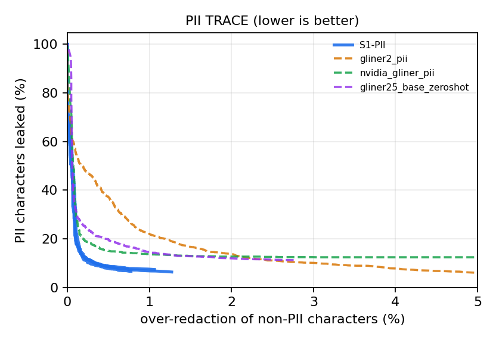
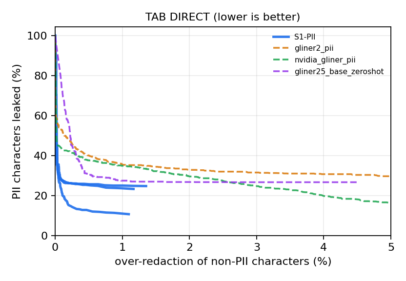
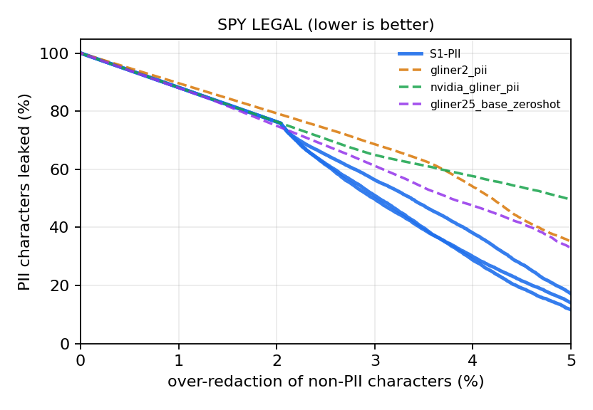
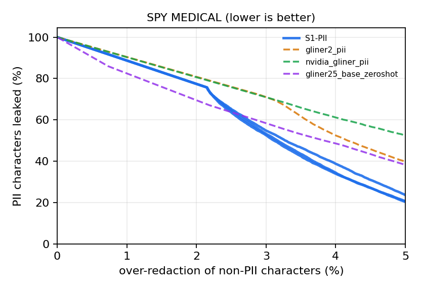
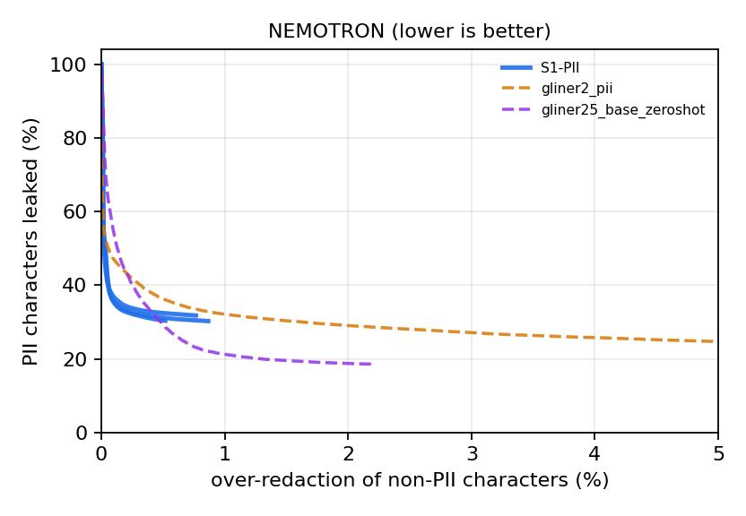

<p align="center"></p>

<p align="center">


</p>

# S1-PII: exact span probabilities for PII redaction

**S1-PII** is a single-pass PII detector that returns an exact probability for every candidate span. A ModernBERT-large encoder feeds a constrained BIOES CRF, and span confidence is the exact segment marginal from forward-backward, not a heuristic score. Thresholding that probability traces the whole leak versus over-redaction curve, so you pick the privacy/utility trade-off instead of inheriting one.

We benchmarked it against the three latest GLiNER PII models on five public benchmarks under a preregistered, leakage-audited protocol with a paired cluster bootstrap over three training seeds. **S1-PII lowers the area under the leak curve on 4 of 5 benchmarks against every baseline**, with a median 10% lower leak area than the best GLiNER model on each benchmark (up to 43%).

<p align="center"> </p>

## Headline result (preregistered C0)

pAUC is the normalized area under the leak curve for over-redaction between 0% and 5% of non-PII characters: the average fraction of PII characters a system leaks when you allow it at most 5% collateral redaction. **Lower is better.** S1-PII is the mean of three training seeds; every comparison is a paired cluster bootstrap (10,000 resamples) with Holm correction over the whole family.

| Benchmark | Test docs (audited) | S1-PII | GLiNER2-PII | NVIDIA GLiNER-PII | GLiNER2.5 | Won |
|---|---|---|---|---|---|---|
| PII-TRACE | 400 | **0.081** | 0.166<br><sub>Δ -0.085 [-0.109, -0.062], p_Holm 0.0028</sub> | 0.144<br><sub>Δ -0.063 [-0.095, -0.032], p_Holm 0.0028</sub> | 0.144<br><sub>Δ -0.062 [-0.083, -0.042], p_Holm 0.0028</sub> | ✅ |
| TAB (direct IDs) | 127 | **0.203** | 0.341<br><sub>Δ -0.138 [-0.159, -0.116], p_Holm 0.0028</sub> | 0.280<br><sub>Δ -0.077 [-0.102, -0.050], p_Holm 0.0028</sub> | 0.297<br><sub>Δ -0.094 [-0.121, -0.068], p_Holm 0.0028</sub> | ✅ |
| SPY legal | 3,358 | **0.659** | 0.795<br><sub>Δ -0.135 [-0.140, -0.131], p_Holm 0.0028</sub> | 0.813<br><sub>Δ -0.154 [-0.162, -0.145], p_Holm 0.0028</sub> | 0.732<br><sub>Δ -0.073 [-0.079, -0.066], p_Holm 0.0028</sub> | ✅ |
| SPY medical | 3,593 | **0.683** | 0.812<br><sub>Δ -0.129 [-0.134, -0.124], p_Holm 0.0028</sub> | 0.863<br><sub>Δ -0.180 [-0.188, -0.172], p_Holm 0.0028</sub> | 0.700<br><sub>Δ -0.017 [-0.024, -0.010], p_Holm 0.0028</sub> | ✅ |
| Nemotron-PII (10k) | 10,020 | 0.313 | 0.298<br><sub>Δ 0.016 [0.006, 0.026], p_Holm 0.0028</sub> | excluded¹ | 0.220<br><sub>Δ 0.093 [0.074, 0.111], p_Holm 0.0028</sub> | ❌ |

Δ = mean-over-seeds pAUC(S1) minus pAUC(baseline) with its 95% bootstrap interval. C0 rule: a benchmark is won only if S1-PII beats **every** baseline on it after Holm correction; C0 holds if at least 3 of 5 benchmarks are won (14 comparisons; Fresh-Real annotation was not ready, so the preregistered fallback rule applies). Result: **C0 holds** (won: PII-TRACE, TAB (direct IDs), SPY legal, SPY medical).

¹ NVIDIA GLiNER-PII was trained on Nemotron-PII, so it is excluded there by design; S1-PII is scored on Nemotron with a model that never saw Nemotron (`no-nemotron` variant).

## Leak at a fixed over-redaction budget

Fraction of PII characters left unredacted at the best threshold that keeps over-redaction at or below 1% and 5%. Lower is better.

| Benchmark | Budget | S1-PII (seeds) | GLiNER2-PII | NVIDIA GLiNER-PII | GLiNER2.5 |
|---|---|---|---|---|---|
| PII-TRACE | 1% | **7.0%** <sub>(6.7%, 7.6%, 6.9%)</sub> | 22.2% | 13.7% | 14.6% |
| PII-TRACE | 5% | 6.8% <sub>(6.7%, 7.4%, 6.4%)</sub> | 6.1% | 12.4% | 11.2% |
| TAB (direct IDs) | 1% | **20.0%** <sub>(25.0%, 23.7%, 11.3%)</sub> | 35.6% | 34.9% | 27.5% |
| TAB (direct IDs) | 5% | 19.6% <sub>(24.7%, 23.3%, 10.7%)</sub> | 29.7% | 16.4% | 26.7% |
| SPY legal | 1% | 100.0% <sub>(100.0%, 100.0%, 100.0%)</sub> | 100.0% | 100.0% | 100.0% |
| SPY legal | 5% | **14.3%** <sub>(11.7%, 17.2%, 14.1%)</sub> | 35.2% | 49.7% | 33.2% |
| SPY medical | 1% | 100.0% <sub>(100.0%, 100.0%, 100.0%)</sub> | 100.0% | 100.0% | 85.9% |
| SPY medical | 5% | **21.6%** <sub>(20.7%, 23.6%, 20.4%)</sub> | 39.9% | 52.6% | 38.5% |
| Nemotron-PII (10k) | 1% | 30.8% <sub>(30.4%, 30.2%, 31.8%)</sub> | 32.1% | excluded | 21.2% |
| Nemotron-PII (10k) | 5% | 30.8% <sub>(30.4%, 30.2%, 31.8%)</sub> | 24.7% | excluded | 18.6% |

<p align="center">  </p>

## Classic NER view: precision, recall, micro and macro F1

Same predictions, scored the conventional way: each model's default threshold (0.5; 0.3 for NVIDIA GLiNER-PII as on its model card), overlapping spans resolved by keeping the highest-scoring one, and **strict** matching (exact offsets and type). Macro F1 averages the canonical PII types present in each benchmark. S1-PII is the mean over three seeds.

| Benchmark | Metric | S1-PII | GLiNER2-PII | NVIDIA GLiNER-PII | GLiNER2.5 |
|---|---|---|---|---|---|
| PII-TRACE | micro P / R / F1 | 0.84 / 0.59 / 0.69 | 0.63 / 0.57 / 0.60 | 0.43 / 0.54 / 0.48 | 0.73 / 0.66 / 0.70 |
| PII-TRACE | macro P / R / F1 | 0.57 / 0.48 / 0.51 | 0.53 / 0.44 / 0.43 | 0.61 / 0.57 / 0.53 | 0.62 / 0.60 / 0.59 |
| TAB (direct IDs) | micro P / R / F1 | 0.19 / 0.03 / 0.05 | 0.09 / 0.25 / 0.13 | 0.01 / 0.02 / 0.01 | 0.36 / 0.36 / 0.36 |
| TAB (direct IDs) | macro P / R / F1 | 0.06 / 0.02 / 0.03 | 0.10 / 0.39 / 0.16 | 0.03 / 0.34 / 0.05 | 0.18 / 0.33 / 0.23 |
| SPY legal | micro P / R / F1 | 0.33 / 0.59 / 0.42 | 0.34 / 0.72 / 0.46 | 0.19 / 0.60 / 0.29 | 0.33 / 0.70 / 0.45 |
| SPY legal | macro P / R / F1 | 0.50 / 0.60 / **0.51** | 0.41 / 0.72 / 0.45 | 0.33 / 0.61 / 0.42 | 0.32 / 0.70 / 0.42 |
| SPY medical | micro P / R / F1 | 0.35 / 0.57 / 0.43 | 0.37 / 0.73 / 0.49 | 0.20 / 0.62 / 0.31 | 0.34 / 0.69 / 0.45 |
| SPY medical | macro P / R / F1 | 0.52 / 0.56 / **0.51** | 0.44 / 0.72 / 0.48 | 0.36 / 0.62 / 0.45 | 0.34 / 0.68 / 0.43 |
| Nemotron-PII (10k) | micro P / R / F1 | 0.76 / 0.53 / 0.63 | 0.74 / 0.55 / 0.63 | excluded | 0.68 / 0.53 / 0.60 |
| Nemotron-PII (10k) | macro P / R / F1 | 0.73 / 0.60 / 0.64 | 0.80 / 0.67 / 0.68 | excluded | 0.68 / 0.60 / 0.61 |

<details><summary><b>Per-category precision / recall / F1 on every benchmark</b> (strict, default thresholds)</summary>


**PII-TRACE**

| Category | S1-PII | GLiNER2-PII | NVIDIA GLiNER-PII | GLiNER2.5 |
|---|---|---|---|---|
| ACCOUNT_NUMBER | 0.21 / 0.28 / 0.24 | 0.17 / 0.12 / 0.14 | 0.36 / 0.95 / 0.53 | 0.35 / 0.37 / 0.36 |
| ADDRESS | 0.95 / 0.63 / 0.75 | 0.20 / 0.16 / 0.18 | 0.86 / 0.89 / 0.87 | 0.86 / 0.95 / 0.90 |
| DATE | n/a / 0.00 / n/a | 0.98 / 0.98 / 0.98 | 0.97 / 1.00 / 0.99 | 0.97 / 0.82 / 0.89 |
| EMAIL | 1.00 / 0.92 / 0.96 | 0.70 / 0.85 / 0.77 | 0.74 / 0.99 / 0.85 | 0.81 / 0.95 / 0.87 |
| OTHER_PII | 0.00 / 0.00 / n/a | 0.02 / 0.01 / 0.01 | 0.06 / 0.01 / 0.02 | n/a / 0.00 / n/a |
| PERSON | 0.94 / 0.89 / 0.91 | 0.92 / 0.93 / 0.93 | 0.15 / 0.28 / 0.20 | 0.80 / 0.83 / 0.81 |
| PHONE | 1.00 / 1.00 / 1.00 | 0.24 / 0.52 / 0.33 | 0.89 / 0.74 / 0.81 | 0.60 / 0.89 / 0.71 |
| SECRET | n/a / 0.00 / n/a | 0.84 / 0.33 / 0.47 | 0.88 / 0.13 / 0.23 | 0.48 / 0.18 / 0.26 |
| URL | 1.00 / 0.62 / 0.76 | 0.67 / 0.05 / 0.09 | 0.59 / 0.16 / 0.25 | 0.70 / 0.38 / 0.49 |

**TAB (direct IDs)**

| Category | S1-PII | GLiNER2-PII | NVIDIA GLiNER-PII | GLiNER2.5 |
|---|---|---|---|---|
| DATE | n/a / 0.00 / n/a | 0.22 / 0.80 / 0.35 | 0.09 / 1.00 / 0.16 | 0.17 / 0.40 / 0.24 |
| OTHER_PII | n/a / 0.00 / n/a | n/a / 0.00 / n/a | n/a / 0.00 / n/a | n/a / 0.00 / n/a |
| PERSON | 0.19 / 0.05 / 0.08 | 0.09 / 0.38 / 0.14 | 0.00 / 0.02 / 0.01 | 0.36 / 0.58 / 0.44 |

**SPY legal**

| Category | S1-PII | GLiNER2-PII | NVIDIA GLiNER-PII | GLiNER2.5 |
|---|---|---|---|---|
| ACCOUNT_NUMBER | 0.75 / 0.75 / 0.75 | 0.53 / 0.56 / 0.54 | 0.48 / 0.66 / 0.55 | 0.45 / 0.55 / 0.50 |
| ADDRESS | 0.87 / 0.80 / 0.83 | 0.41 / 0.91 / 0.57 | 0.46 / 0.84 / 0.60 | 0.51 / 0.93 / 0.66 |
| EMAIL | 0.35 / 0.96 / 0.51 | 0.33 / 0.96 / 0.49 | 0.47 / 0.94 / 0.63 | 0.34 / 0.96 / 0.50 |
| OTHER_PII | 0.62 / 0.48 / 0.54 | 0.49 / 0.65 / 0.56 | 0.46 / 0.95 / 0.62 | 0.02 / 0.00 / 0.01 |
| PERSON | 0.02 / 0.10 / 0.04 | 0.23 / 0.96 / 0.37 | 0.00 / 0.00 / 0.00 | 0.20 / 0.96 / 0.33 |
| PHONE | 0.42 / 0.75 / 0.54 | 0.33 / 0.91 / 0.48 | 0.28 / 0.62 / 0.39 | 0.34 / 0.91 / 0.49 |
| URL | 0.45 / 0.36 / 0.39 | 0.56 / 0.09 / 0.15 | 0.14 / 0.23 / 0.17 | 0.40 / 0.58 / 0.47 |

**SPY medical**

| Category | S1-PII | GLiNER2-PII | NVIDIA GLiNER-PII | GLiNER2.5 |
|---|---|---|---|---|
| ACCOUNT_NUMBER | 0.80 / 0.69 / 0.73 | 0.60 / 0.57 / 0.59 | 0.59 / 0.74 / 0.66 | 0.50 / 0.54 / 0.52 |
| ADDRESS | 0.89 / 0.80 / 0.83 | 0.42 / 0.90 / 0.57 | 0.46 / 0.85 / 0.60 | 0.53 / 0.92 / 0.67 |
| EMAIL | 0.37 / 0.94 / 0.53 | 0.36 / 0.94 / 0.52 | 0.51 / 0.92 / 0.66 | 0.36 / 0.94 / 0.52 |
| OTHER_PII | 0.67 / 0.40 / 0.50 | 0.55 / 0.70 / 0.61 | 0.49 / 0.92 / 0.64 | 0.03 / 0.00 / 0.01 |
| PERSON | 0.03 / 0.09 / 0.04 | 0.25 / 0.93 / 0.39 | 0.00 / 0.00 / n/a | 0.19 / 0.84 / 0.30 |
| PHONE | 0.46 / 0.73 / 0.56 | 0.34 / 0.89 / 0.50 | 0.31 / 0.64 / 0.41 | 0.36 / 0.89 / 0.51 |
| URL | 0.42 / 0.31 / 0.35 | 0.56 / 0.10 / 0.16 | 0.14 / 0.24 / 0.18 | 0.39 / 0.61 / 0.47 |

**Nemotron-PII (10k)**

| Category | S1-PII | GLiNER2-PII | NVIDIA GLiNER-PII | GLiNER2.5 |
|---|---|---|---|---|
| ACCOUNT_NUMBER | 0.88 / 0.63 / 0.73 | 0.84 / 0.76 / 0.80 | excluded | 0.91 / 0.69 / 0.78 |
| ADDRESS | 0.70 / 0.58 / 0.64 | 0.92 / 0.93 / 0.93 | excluded | 0.45 / 0.63 / 0.53 |
| DATE | 1.00 / 0.99 / 0.99 | 0.90 / 1.00 / 0.95 | excluded | 0.88 / 1.00 / 0.94 |
| EMAIL | 1.00 / 0.99 / 1.00 | 0.97 / 0.99 / 0.98 | excluded | 0.98 / 0.99 / 0.99 |
| OTHER_PII | 0.82 / 0.41 / 0.55 | 0.79 / 0.46 / 0.58 | excluded | 0.50 / 0.05 / 0.09 |
| PERSON | 0.47 / 0.33 / 0.39 | 0.31 / 0.16 / 0.21 | excluded | 0.39 / 0.29 / 0.33 |
| PHONE | 0.77 / 0.98 / 0.86 | 0.94 / 0.98 / 0.96 | excluded | 0.95 / 0.98 / 0.96 |
| SECRET | 0.84 / 0.47 / 0.60 | 0.70 / 0.76 / 0.73 | excluded | 0.44 / 0.51 / 0.47 |
| URL | 0.33 / 0.00 / 0.00 | 0.82 / 0.01 / 0.02 | excluded | 0.59 / 0.28 / 0.38 |

</details>

## Where S1-PII falls short

We report these because they are real and you will find them anyway.

* **Nemotron-PII: S1-PII loses.** On the Nemotron test sample S1-PII is scored with the variant that never saw Nemotron, and both GLiNER models leak less (GLiNER2.5 pAUC 0.220, GLiNER2-PII 0.298 versus S1-PII 0.313). Out-of-distribution transfer to this template-generated, 50+ label corpus is the clearest open problem.
* **Generic dates.** The training taxonomy treats generic dates in Nemotron-PII and Gretel as quasi-identifiers (IGNORE); only dates of birth are PII. S1-PII therefore does not tag appointment or event dates, which PII-TRACE and TAB count as PII. This asymmetry is disclosed in the preregistration.
* **Calibration off-domain.** On long legal text (TAB) S1-PII ranks PII characters well (it wins on pAUC) but its probabilities sit far below 0.5, so a fixed 0.5 threshold misses most names. Use a threshold tuned on a small in-domain calibration split (the benchmark does this automatically) or recalibrate with the included temperature and isotonic tools.
* **Secrets.** SECRET spans are found at low probability; recall at 0.5 is low even where the leak curve is good.
* **Synthetic dates of birth drifted across runs.** The synthetic training conversations drew dates of birth relative to the run date, so `all-sources` seed 3 and the `no-nemotron` runs (started after midnight UTC) saw different DOB strings than seeds 1 and 2. Same sources and counts; fixed for future runs (details in DEVIATIONS).
* **Seed variance on small sets.** TAB has 127 test documents; per-seed pAUC varies noticeably, so we always report the three seeds.

## How it works

```
text ──► ModernBERT-large ──► linear emissions (37 BIOES tags: O + B/I/E/S × 9 types) ──► constrained linear-chain CRF
                                                                                        │
        exact forward-backward lattices ◄───────────────────────────────────────────────┘
        P(span i..j has type t) = P(y_i=B_t, y_i+1..j-1=I_t, y_j=E_t | x)   (S_t when i = j)
        ► every candidate span with P ≥ 0.01 is emitted; the threshold picks the operating point
```

* **Training:** synthetic conversations (seeded Faker), Nemotron-PII train and Gretel finance (English), with dev slices held out; partial-label CRF loss so unannotated or quasi-identifier regions never teach the model a wrong "not PII". Two variants (`all-sources`, `no-nemotron`) × three seeds, each about 55 minutes (or 17) on one A100.
* **Canonical types:** PERSON, ADDRESS, EMAIL, PHONE, URL, DATE, ACCOUNT_NUMBER, SECRET, OTHER_PII, with fail-closed label maps for every dataset.
* **Deterministic channel:** Luhn, IBAN, SSN, ABA and phone validators add high-precision spans. Cross-mention propagation was tested on the calibration split (C2) and switched off because it added no spans.

## Benchmark protocol

* **Metric:** character-level leak versus over-redaction over alphanumeric characters, pAUC on [0, 5%] with an exact step function; predictions of types a benchmark does not annotate are dropped for every system.
* **Statistics:** paired cluster bootstrap with shared weights across the three S1 seeds and the baseline, Holm correction over the full family, decision rule fixed before any result (see `prereg/v0.md`).
* **Leakage audit:** MinHash (word 5-grams, Jaccard ≥ 0.8) and skeleton hashing against each model's exact training data; any flagged test cluster is removed for every system.
* **Fair baselines:** every GLiNER model gets the full canonical label set (plus its native labels), label descriptions where supported, identical windowing and emission floor, pinned revisions, and isolated environments.
* **Deviations** from the preregistered plan are listed with reasons in [`docs/DEVIATIONS.md`](docs/DEVIATIONS.md). Raw numbers: [`docs/final_results.json`](docs/final_results.json), [`docs/c0.json`](docs/c0.json).

## Reproduce

```bash
pip install -e ".[dev,model,data]" && pytest -q
```

On Google Colab (A100), run `notebooks/00` through `05` in order. Everything is resumable and cached on Google Drive; data splits, model revisions and environment locks are pinned in the repo.

| Notebook | GPU | What it does |
|---|---|---|
| `00_env_and_drive_sync` | any | install, run tests |
| `01_build_data` | none | label and offset census, snapshots, calibration/test splits |
| `02_run_baselines` | A100 | GLiNER2-PII, NVIDIA GLiNER-PII, GLiNER2.5 zero-shot |
| `03_train_s1` | A100 | six preregistered S1 runs (`scripts/train_queue.sh`) |
| `04_predict_and_score_s1` | A100 | S1 predictions through the same runner |
| `05_audit_c0_report` | none | leakage audit, C2, C0 decision, figures |

## Citation

```bibtex
@software{sahu2026s1pii,
  author = {Sahu, Anit Kumar},
  title  = {S1-PII: Exact Span Probabilities for PII Redaction},
  year   = {2026},
  url    = {https://github.com/anitksahu/s1-pii}
}
```

## License

Code: Apache-2.0. Benchmarks and baselines keep their own licenses (TAB: MIT; SPY, Nemotron-PII: CC-BY-4.0; PII-TRACE: MIT; Gretel: Apache-2.0).
