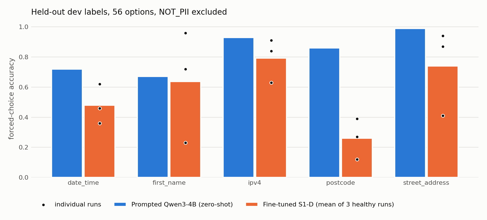

<p align="center"></p>

<p align="center">


</p>

# S1-PII: System One decision models for PII

A **System One (S1) model** makes a typed decision in a single forward pass: the caller supplies the questions and their options at inference, and the model returns a probability for every option without generating text. **S1-D** applies this to PII. A span proposer finds candidate spans, and a Qwen3 decision model, fine-tuned with LoRA and a pointer head, scores each span against a list of PII labels plus "not personal information" that the caller can change at inference.

The question this repository answers is whether such a fine-tuned S1 model can type PII labels it never saw in training. On the 5 dev labels the best fine-tuned run does not match the strongest simple alternative, prompting Qwen3-4B zero-shot (0.55 against 0.83 forced-choice macro accuracy), although fine-tuned runs separate non-PII spans somewhat better. The repository also contains the benchmark harness and a fixed-taxonomy **CRF redactor** (ModernBERT-large with a constrained CRF; not an S1 model), which serves as the redaction baseline and is compared against the GLiNER family on five public benchmarks.

## At a glance

Three related studies, each reported with its negative results. Only S1-D is a System One model.

| Study | Question | Outcome |
|---|---|---|
| **CRF redactor (v1)** | Does a fixed-taxonomy CRF with exact span probabilities leak less than GLiNER at a given over-redaction budget? | **Yes on 4 of 5 benchmarks** (preregistered C0 holds); loses on Nemotron-PII |
| **CRF with labels at inference (v2)** | Can the same CRF take its label set at inference and abstain in a calibrated way? | **Mostly no**: redaction with supplied canonical labels holds 3 of 5; zero-shot typing and selective leak fail |
| **S1-D** | Does a System One Qwen3 decision model, fine-tuned to point at options supplied at inference, type labels it never saw? | **No, on the 5 dev labels**: prompted Qwen3-4B reaches 0.83 forced-choice macro accuracy against 0.55 for the one healthy fine-tuned 4B run (the other seed collapsed); at 1.7B fine-tuning beats prompting (0.22 to 0.28 against 0.11 dev macro). Fine-tuning separates non-PII spans somewhat better (AUROC 0.75 to 0.84 against 0.71) but rejects 54% to 70% of held-out gold spans |


## S1-D: a System One decision model for PII (dev results; mostly negative)

The caller supplies one question per candidate span and a shared list of options at inference. A pointer head scores every option against each question in one forward pass, and the model never generates text.

```
document ──► span proposer (class-agnostic ModernBERT BIOES tagger) ──► candidate spans

<state> 512-token window </state>  <opt> option 1 </opt> … <opt> option 56 </opt>
<q> span 1 <decide> … <q> span 64 <decide>
        │  Qwen3 0.6B / 1.7B / 4B, LoRA r=32, block-sparse FlexAttention mask:
        │  options see the state; each question sees the state and all options
        ▼
P(option k | span j) = softmax_k( ⟨W_d h_decide,j , W_o h_opt,k⟩ / √d + b )
options: 55 fine-grained PII labels + "not personal information"
```

Questions in a window share one encoded state and one encoded option block, so a 512-token window with up to 64 candidate spans costs a single forward pass. Measured end to end on one A100 with the proposer included, p95 latency per window is 271 ms (0.6B), 315 ms (1.7B) and 425 ms (4B).

### Protocol

* **Held-out labels.** From 45 eligible fine-grained labels, a fixed seed drew 5 dev labels (`date_time`, `first_name`, `ipv4`, `postcode`, `street_address`) and 10 test labels. Spans of held-out labels and their semantic neighbors are never training targets, options or hard negatives (`s1pii/configs/s1d_heldout.yaml`).
* **Dev questions.** 3,091 questions on the Nemotron-PII calibration slice, which no training run sees: 2,266 gold spans of the 5 dev labels and 825 proposer candidates that overlap no gold span (target "not personal information"). Every question offers the same 56 options.
* **In-domain sanity.** 700 questions on the Gretel dev slice, also excluded from training: 350 gold spans of trained labels and 350 proposer negatives. A run counts as collapsed if gold accuracy falls below 0.5, more than 30% of gold spans are called not PII, or one option takes more than 60% of the predictions on gold spans.
* **Baseline.** The same Qwen3 checkpoint prompted zero-shot with one prompt format: the 512-token window, the span, and all 56 options as numbered codes; the answer distribution is read from the code likelihoods.
* **Metrics.** Macro accuracy over the 5 dev labels; *forced-choice* macro accuracy, the same with "not personal information" excluded from the argmax; not-PII accuracy on the 825 proposer negatives; and the AUROC of the not-PII probability for separating those negatives from gold spans.

### Result on held-out labels

Training recipe from the Lessons below, all three training sources with label-balanced sampling, final checkpoint, two seeds per size.

| System | Dev macro | Forced-choice macro | Not-PII accuracy | Not-PII AUROC | In-domain sanity (gold acc.) |
|---|---|---|---|---|---|
| **Prompted Qwen3-4B, zero-shot** | **0.829** | **0.831** | 0.093 | 0.708 | n/a |
| Prompted Qwen3-1.7B, zero-shot | 0.106 | not measured | 0.024 | not measured | n/a |
| Prompted Qwen3-0.6B, zero-shot | 0.118 | not measured | 0.000 | not measured | n/a |
| S1-D 1.7B, seed 1 | 0.224 | 0.553 | 0.888 | 0.753 | 0.917 |
| S1-D 1.7B, seed 2 | 0.282 | 0.647 | **0.918** | 0.825 | 0.914 |
| S1-D 4B, seed 1 | 0.279 | 0.546 | 0.914 | **0.838** | 0.920 |
| S1-D 4B, seed 2 (collapsed) | 0.002 | 0.002 | 0.087 | 0.665 | 0.080 |

<p align="center"></p>

### Findings

Ranges below cover the three healthy fine-tuned runs; 4B seed 2 collapsed and is reported separately in the table.

1. **At 4B, prompting the base model beats fine-tuning it on held-out labels.** Zero-shot Qwen3-4B reaches 0.83 forced-choice macro accuracy; the one healthy fine-tuned 4B run reaches 0.55, and the 1.7B runs 0.55 and 0.65. At 1.7B the order reverses: fine-tuned runs reach 0.22 to 0.28 dev macro against 0.11 for the prompted model; with this prompt format the prompted 0.6B also sits near 0.11. We do not isolate why fine-tuning falls short at 4B. Loss of backbone knowledge, the switch from the language-model head to a newly trained pointer head, and training that rewards "not personal information" for any span outside the trained labels are all consistent with the data.
2. **Fine-tuning separates non-PII spans better, at a cost.** The not-PII score of fine-tuned runs separates proposer negatives from gold spans somewhat better (AUROC 0.75 to 0.84 against 0.71), and at the default argmax they reject 89% to 92% of proposer negatives where the prompted 4B rejects 9%. At that same operating point they also call 54% to 70% of held-out gold spans not PII, so the two systems sit at opposite ends of the trade-off.
3. **Plain macro accuracy hides that half of the gap is abstention.** Excluding "not personal information" from the argmax raises fine-tuned macro accuracy (0.22 to 0.28) to a forced-choice accuracy of 0.55 to 0.65. Even a perfect abstention threshold would therefore leave them below the prompted 4B.
4. **Generalization is label dependent and seed dependent.** Fine-tuned runs beat the base model only on `first_name` (0.72 and 0.96 against 0.67 in two of three runs), come close on `ipv4` (up to 0.91 against 0.93) and `street_address` (up to 0.94 against 0.99), and fail on `postcode` (0.12 to 0.39 against 0.86) and `date_time` (0.36 to 0.62 against 0.72). The same label moves from 0.23 to 0.72 between the two 1.7B seeds.
5. **All-sources training with the stable recipe raised dev macro but did not close the gap.** Moving from two training sources and 22 target labels to all three sources (35 target labels) with label-balanced sampling (top label share 15% down to 8%) raised 1.7B pooled dev macro from 0.123 to 0.253 while keeping not-PII accuracy near 0.90. That comparison also changed the optimizer recipe, and the earlier 0.123 includes a run that collapsed in-domain, so the gain is not attributable to coverage alone.

### Lessons from training it

These cost the most compute to learn. They come from one architecture, one task and two seeds per setting.

* **The answer can leak through the option wording.** Our first training set described "not personal information" one way on real PII spans, where it was never correct, and left it bare on hard negatives, where it was always correct. The model learned the wording, not the span: on held-out Gretel spans in training format, the 0.6B models scored 96% to 98% with the described option and 17% (seed 2) or 0.75% (seed 1) with the bare one. Every question type now uses one identical option, and a test enforces it.
* **Early training swings between global favorites.** For the first half or more of training the preferred answer jumps between options such as email, first name, phone number and "not personal information" before span-conditioned decisions settle (in the 4B pilot the last collapsed checkpoint was number 15 of 29 in one seed and 19 of 29 in the other). In the six runs with the original recipe (constant learning rate, no warmup, and different training data), the final checkpoint landed wherever the swing happened to be: 3 ended collapsed in-domain and a fourth was weak (macro accuracy 0.47).
* **With warmup, clipping at 1.0, a separate pointer-head learning rate and linear decay to zero, 7 of 8 final checkpoints were healthy.** This is an observation, not a controlled comparison: the only paired pilot against the original recipe (1.7B, 330 updates) collapsed at most checkpoints under both recipes, and the original runs used different data. In the 1.7B stable-recipe pilot (both seeds with identical data, initial weights and dropout noise; 16k questions) both seeds ended healthy (gold accuracy 0.920 and 0.914), as did both 4B pilot seeds (0.911 and 0.931); in the all-sources runs above one of four failed (4B seed 2). The swings never vanished: 5 and 7 of 28 post-warmup checkpoints still collapsed at 1.7B.
* **Bigger batches and lower learning rates gave more collapsed checkpoints, not fewer.** At equal question exposure in the 1.7B pilot, 8× gradient accumulation produced 11 collapsed checkpoints of 28 in both seeds, and lowering the LoRA and new-token embedding learning rates to 5e-5 produced 10 and 9, against 5 and 7 for the stable recipe. Both also ended with lower gold accuracy (0.85 to 0.91 against 0.91 to 0.92).
* **The layout ablation was uninformative.** Packing shared options once per window against repeating them per question (0.6B, original recipe, 4k windows, two seeds each) left all four runs at 0.02 dev macro or below, so it cannot separate the layouts; S1-D uses the shared layout.
* **We found no evidence that batch composition drives the collapses.** Runs in the paired pilot saw identical batches yet collapsed at different checkpoints, and collapses were not preceded by unusually concentrated batches.

### Limitations

* All S1-D numbers are on the 5 **dev** labels, which guided design decisions. The 10 test labels have not been evaluated.
* Two seeds per size and one prompt format for the baseline. Only one healthy fine-tuned 4B run exists, and ranges for fine-tuned runs exclude the collapsed 4B seed 2.
* The all-sources runs train on Nemotron training documents, so dev documents are in-distribution while dev labels are not.
* The prompted baseline almost never abstains, so its macro accuracy measures typing of real PII spans, not end-to-end detection.
* GLiNER and S1-D have not been run on the same held-out-label questions. The closest comparison is v2 C3 in the CRF study below (10 different held-out labels, span extraction rather than given spans), where GLiNER2.5 typed 79% of gold spans correctly.

Raw results: [`docs/results_s1d/`](docs/results_s1d/) (metrics per stage; per-question probabilities for the final runs in `stage1_cov-train_eval.probabilities.json.gz`). Code: `s1pii/s1d/`, configuration in `s1pii/configs/s1d.yaml`, notebook `notebooks/06_s1d.ipynb`.

## Baseline study: the CRF redactor against GLiNER

The CRF redactor is a single-pass, fixed-taxonomy PII detector: a ModernBERT-large encoder feeds a constrained BIOES CRF, and span confidence is the exact segment marginal from forward-backward. Thresholding that probability traces the whole leak versus over-redaction curve. We benchmarked it against the three latest GLiNER PII models on five public benchmarks under a preregistered, leakage-audited protocol with a paired cluster bootstrap over three training seeds. **It lowers the area under the leak curve on 4 of 5 benchmarks against every baseline**, with a median 10% lower leak area than the best GLiNER model on each benchmark (up to 43%).

<p align="center"> </p>

### Headline result (preregistered C0)

pAUC is the normalized area under the leak curve for over-redaction between 0% and 5% of non-PII characters: the average fraction of PII characters a system leaks when you allow it at most 5% collateral redaction. **Lower is better.** The CRF redactor is the mean of three training seeds; every comparison is a paired cluster bootstrap (10,000 resamples) with Holm correction over the whole family.

| Benchmark | Test docs (audited) | CRF redactor | GLiNER2-PII | NVIDIA GLiNER-PII | GLiNER2.5 | Won |
|---|---|---|---|---|---|---|
| PII-TRACE | 400 | **0.081** | 0.166<br><sub>Δ -0.085 [-0.109, -0.062], p_Holm 0.0028</sub> | 0.144<br><sub>Δ -0.063 [-0.095, -0.032], p_Holm 0.0028</sub> | 0.144<br><sub>Δ -0.062 [-0.083, -0.042], p_Holm 0.0028</sub> | ✅ |
| TAB (direct IDs) | 127 | **0.203** | 0.341<br><sub>Δ -0.138 [-0.159, -0.116], p_Holm 0.0028</sub> | 0.280<br><sub>Δ -0.077 [-0.102, -0.050], p_Holm 0.0028</sub> | 0.297<br><sub>Δ -0.094 [-0.121, -0.068], p_Holm 0.0028</sub> | ✅ |
| SPY legal | 3,358 | **0.659** | 0.795<br><sub>Δ -0.135 [-0.140, -0.131], p_Holm 0.0028</sub> | 0.813<br><sub>Δ -0.154 [-0.162, -0.145], p_Holm 0.0028</sub> | 0.732<br><sub>Δ -0.073 [-0.079, -0.066], p_Holm 0.0028</sub> | ✅ |
| SPY medical | 3,593 | **0.683** | 0.812<br><sub>Δ -0.129 [-0.134, -0.124], p_Holm 0.0028</sub> | 0.863<br><sub>Δ -0.180 [-0.188, -0.172], p_Holm 0.0028</sub> | 0.700<br><sub>Δ -0.017 [-0.024, -0.010], p_Holm 0.0028</sub> | ✅ |
| Nemotron-PII (10k) | 10,020 | 0.313 | 0.298<br><sub>Δ 0.016 [0.006, 0.026], p_Holm 0.0028</sub> | excluded¹ | 0.220<br><sub>Δ 0.093 [0.074, 0.111], p_Holm 0.0028</sub> | ❌ |

Δ = mean-over-seeds pAUC(CRF) minus pAUC(baseline) with its 95% bootstrap interval. C0 rule: a benchmark is won only if the CRF redactor beats **every** baseline on it after Holm correction; C0 holds if at least 3 of 5 benchmarks are won (14 comparisons; Fresh-Real annotation was not ready, so the preregistered fallback rule applies); 12 of the 14 comparisons are Holm-significant wins. Result: **C0 holds** (won: PII-TRACE, TAB (direct IDs), SPY legal, SPY medical).

¹ NVIDIA GLiNER-PII was trained on Nemotron-PII, so it is excluded there by design; the CRF redactor is scored on Nemotron with a model that never saw Nemotron (`no-nemotron` variant).

### Leak at a fixed over-redaction budget

Fraction of PII characters left unredacted at the best threshold that keeps over-redaction at or below 1% and 5%. Lower is better.

| Benchmark | Budget | CRF redactor (seeds) | GLiNER2-PII | NVIDIA GLiNER-PII | GLiNER2.5 |
|---|---|---|---|---|---|
| PII-TRACE | 1% | **7.0%** <sub>(6.7%, 7.6%, 6.9%)</sub> | 22.2% | 13.7% | 14.6% |
| PII-TRACE | 5% | 6.8% <sub>(6.7%, 7.4%, 6.4%)</sub> | 6.1% | 12.4% | 11.2% |
| TAB (direct IDs) | 1% | **20.0%** <sub>(25.0%, 23.7%, 11.3%)</sub> | 35.6% | 34.9% | 27.5% |
| TAB (direct IDs) | 5% | 19.6% <sub>(24.7%, 23.3%, 10.7%)</sub> | 29.7% | 16.4% | 26.7% |
| SPY legal | 1% | 100.0% <sub>(100.0%, 100.0%, 100.0%)</sub> | 100.0% | 100.0% | 100.0% |
| SPY legal | 5% | **14.3%** <sub>(11.7%, 17.2%, 14.1%)</sub> | 35.2% | 49.7% | 33.2% |
| SPY medical | 1% | 100.0% <sub>(100.0%, 100.0%, 100.0%)</sub> | 100.0% | 100.0% | 85.9% |
| SPY medical | 5% | **21.6%** <sub>(20.7%, 23.6%, 20.4%)</sub> | 39.9% | 52.6% | 38.5% |
| Nemotron-PII (10k) | 1% | 30.8% <sub>(30.4%, 30.2%, 31.8%)</sub> | 32.1% | excluded | 21.2% |
| Nemotron-PII (10k) | 5% | 30.8% <sub>(30.4%, 30.2%, 31.8%)</sub> | 24.7% | excluded | 18.6% |

<p align="center">  </p>

### Classic NER view: precision, recall, micro and macro F1

Same predictions, scored the conventional way: each model's default threshold (0.5; 0.3 for NVIDIA GLiNER-PII as on its model card), overlapping spans resolved by keeping the highest-scoring one, and **strict** matching (exact offsets and type). Macro F1 averages the canonical PII types present in each benchmark. The CRF redactor is the mean over three seeds.

| Benchmark | Metric | CRF redactor | GLiNER2-PII | NVIDIA GLiNER-PII | GLiNER2.5 |
|---|---|---|---|---|---|
| PII-TRACE | micro P / R / F1 | 0.84 / 0.59 / 0.69 | 0.63 / 0.57 / 0.60 | 0.43 / 0.54 / 0.48 | 0.73 / 0.66 / 0.70 |
| PII-TRACE | macro P / R / F1 | 0.57 / 0.48 / 0.51 | 0.53 / 0.44 / 0.43 | 0.61 / 0.57 / 0.53 | 0.62 / 0.60 / 0.59 |
| TAB (direct IDs) | micro P / R / F1 | 0.19 / 0.03 / 0.05 | 0.09 / 0.25 / 0.13 | 0.01 / 0.02 / 0.01 | 0.36 / 0.36 / 0.36 |
| TAB (direct IDs) | macro P / R / F1 | 0.06 / 0.02 / 0.03 | 0.10 / 0.39 / 0.16 | 0.03 / 0.34 / 0.05 | 0.18 / 0.33 / 0.23 |
| SPY legal | micro P / R / F1 | 0.33 / 0.59 / 0.42 | 0.34 / 0.72 / 0.46 | 0.19 / 0.60 / 0.29 | 0.33 / 0.70 / 0.45 |
| SPY legal | macro P / R / F1 | 0.50 / 0.60 / **0.51** | 0.41 / 0.72 / 0.45 | 0.33 / 0.61 / 0.42 | 0.32 / 0.70 / 0.42 |
| SPY medical | micro P / R / F1 | 0.35 / 0.57 / 0.43 | 0.37 / 0.73 / 0.49 | 0.20 / 0.62 / 0.31 | 0.34 / 0.69 / 0.45 |
| SPY medical | macro P / R / F1 | 0.52 / 0.56 / **0.51** | 0.44 / 0.72 / 0.48 | 0.36 / 0.62 / 0.45 | 0.34 / 0.68 / 0.43 |
| Nemotron-PII (10k) | micro P / R / F1 | 0.76 / 0.53 / 0.63 | 0.74 / 0.55 / 0.63 | excluded | 0.68 / 0.53 / 0.60 |
| Nemotron-PII (10k) | macro P / R / F1 | 0.73 / 0.60 / 0.64 | 0.80 / 0.67 / 0.68 | excluded | 0.68 / 0.60 / 0.61 |

<details><summary><b>Per-category precision / recall / F1 on every benchmark</b> (strict, default thresholds)</summary>


**PII-TRACE**

| Category | CRF redactor | GLiNER2-PII | NVIDIA GLiNER-PII | GLiNER2.5 |
|---|---|---|---|---|
| ACCOUNT_NUMBER | 0.21 / 0.28 / 0.24 | 0.17 / 0.12 / 0.14 | 0.36 / 0.95 / 0.53 | 0.35 / 0.37 / 0.36 |
| ADDRESS | 0.95 / 0.63 / 0.75 | 0.20 / 0.16 / 0.18 | 0.86 / 0.89 / 0.87 | 0.86 / 0.95 / 0.90 |
| DATE | n/a / 0.00 / n/a | 0.98 / 0.98 / 0.98 | 0.97 / 1.00 / 0.99 | 0.97 / 0.82 / 0.89 |
| EMAIL | 1.00 / 0.92 / 0.96 | 0.70 / 0.85 / 0.77 | 0.74 / 0.99 / 0.85 | 0.81 / 0.95 / 0.87 |
| OTHER_PII | 0.00 / 0.00 / n/a | 0.02 / 0.01 / 0.01 | 0.06 / 0.01 / 0.02 | n/a / 0.00 / n/a |
| PERSON | 0.94 / 0.89 / 0.91 | 0.92 / 0.93 / 0.93 | 0.15 / 0.28 / 0.20 | 0.80 / 0.83 / 0.81 |
| PHONE | 1.00 / 1.00 / 1.00 | 0.24 / 0.52 / 0.33 | 0.89 / 0.74 / 0.81 | 0.60 / 0.89 / 0.71 |
| SECRET | n/a / 0.00 / n/a | 0.84 / 0.33 / 0.47 | 0.88 / 0.13 / 0.23 | 0.48 / 0.18 / 0.26 |
| URL | 1.00 / 0.62 / 0.76 | 0.67 / 0.05 / 0.09 | 0.59 / 0.16 / 0.25 | 0.70 / 0.38 / 0.49 |

**TAB (direct IDs)**

| Category | CRF redactor | GLiNER2-PII | NVIDIA GLiNER-PII | GLiNER2.5 |
|---|---|---|---|---|
| DATE | n/a / 0.00 / n/a | 0.22 / 0.80 / 0.35 | 0.09 / 1.00 / 0.16 | 0.17 / 0.40 / 0.24 |
| OTHER_PII | n/a / 0.00 / n/a | n/a / 0.00 / n/a | n/a / 0.00 / n/a | n/a / 0.00 / n/a |
| PERSON | 0.19 / 0.05 / 0.08 | 0.09 / 0.38 / 0.14 | 0.00 / 0.02 / 0.01 | 0.36 / 0.58 / 0.44 |

**SPY legal**

| Category | CRF redactor | GLiNER2-PII | NVIDIA GLiNER-PII | GLiNER2.5 |
|---|---|---|---|---|
| ACCOUNT_NUMBER | 0.75 / 0.75 / 0.75 | 0.53 / 0.56 / 0.54 | 0.48 / 0.66 / 0.55 | 0.45 / 0.55 / 0.50 |
| ADDRESS | 0.87 / 0.80 / 0.83 | 0.41 / 0.91 / 0.57 | 0.46 / 0.84 / 0.60 | 0.51 / 0.93 / 0.66 |
| EMAIL | 0.35 / 0.96 / 0.51 | 0.33 / 0.96 / 0.49 | 0.47 / 0.94 / 0.63 | 0.34 / 0.96 / 0.50 |
| OTHER_PII | 0.62 / 0.48 / 0.54 | 0.49 / 0.65 / 0.56 | 0.46 / 0.95 / 0.62 | 0.02 / 0.00 / 0.01 |
| PERSON | 0.02 / 0.10 / 0.04 | 0.23 / 0.96 / 0.37 | 0.00 / 0.00 / 0.00 | 0.20 / 0.96 / 0.33 |
| PHONE | 0.42 / 0.75 / 0.54 | 0.33 / 0.91 / 0.48 | 0.28 / 0.62 / 0.39 | 0.34 / 0.91 / 0.49 |
| URL | 0.45 / 0.36 / 0.39 | 0.56 / 0.09 / 0.15 | 0.14 / 0.23 / 0.17 | 0.40 / 0.58 / 0.47 |

**SPY medical**

| Category | CRF redactor | GLiNER2-PII | NVIDIA GLiNER-PII | GLiNER2.5 |
|---|---|---|---|---|
| ACCOUNT_NUMBER | 0.80 / 0.69 / 0.73 | 0.60 / 0.57 / 0.59 | 0.59 / 0.74 / 0.66 | 0.50 / 0.54 / 0.52 |
| ADDRESS | 0.89 / 0.80 / 0.83 | 0.42 / 0.90 / 0.57 | 0.46 / 0.85 / 0.60 | 0.53 / 0.92 / 0.67 |
| EMAIL | 0.37 / 0.94 / 0.53 | 0.36 / 0.94 / 0.52 | 0.51 / 0.92 / 0.66 | 0.36 / 0.94 / 0.52 |
| OTHER_PII | 0.67 / 0.40 / 0.50 | 0.55 / 0.70 / 0.61 | 0.49 / 0.92 / 0.64 | 0.03 / 0.00 / 0.01 |
| PERSON | 0.03 / 0.09 / 0.04 | 0.25 / 0.93 / 0.39 | 0.00 / 0.00 / n/a | 0.19 / 0.84 / 0.30 |
| PHONE | 0.46 / 0.73 / 0.56 | 0.34 / 0.89 / 0.50 | 0.31 / 0.64 / 0.41 | 0.36 / 0.89 / 0.51 |
| URL | 0.42 / 0.31 / 0.35 | 0.56 / 0.10 / 0.16 | 0.14 / 0.24 / 0.18 | 0.39 / 0.61 / 0.47 |

**Nemotron-PII (10k)**

| Category | CRF redactor | GLiNER2-PII | NVIDIA GLiNER-PII | GLiNER2.5 |
|---|---|---|---|---|
| ACCOUNT_NUMBER | 0.88 / 0.63 / 0.73 | 0.84 / 0.76 / 0.80 | excluded | 0.91 / 0.69 / 0.78 |
| ADDRESS | 0.70 / 0.58 / 0.64 | 0.92 / 0.93 / 0.93 | excluded | 0.45 / 0.63 / 0.53 |
| DATE | 1.00 / 0.99 / 0.99 | 0.90 / 1.00 / 0.95 | excluded | 0.88 / 1.00 / 0.94 |
| EMAIL | 1.00 / 0.99 / 1.00 | 0.97 / 0.99 / 0.98 | excluded | 0.98 / 0.99 / 0.99 |
| OTHER_PII | 0.82 / 0.41 / 0.55 | 0.79 / 0.46 / 0.58 | excluded | 0.50 / 0.05 / 0.09 |
| PERSON | 0.47 / 0.33 / 0.39 | 0.31 / 0.16 / 0.21 | excluded | 0.39 / 0.29 / 0.33 |
| PHONE | 0.77 / 0.98 / 0.86 | 0.94 / 0.98 / 0.96 | excluded | 0.95 / 0.98 / 0.96 |
| SECRET | 0.84 / 0.47 / 0.60 | 0.70 / 0.76 / 0.73 | excluded | 0.44 / 0.51 / 0.47 |
| URL | 0.33 / 0.00 / 0.00 | 0.82 / 0.01 / 0.02 | excluded | 0.59 / 0.28 / 0.38 |

</details>

### Where the CRF redactor helps, where it does not, and why

#### Where it helps

* **Leak area on benchmarks it never trained on.** Lower pAUC than all three GLiNER models on PII-TRACE, TAB, SPY legal and SPY medical (C0 above). None of the four is in the CRF's training data, and the leakage audit flagged no test document.
* **Strict budgets on PII-TRACE and TAB.** At 1% over-redaction the CRF leaks 7.0% on PII-TRACE (best GLiNER 13.7%) and 20.0% on TAB (best GLiNER 27.5%).
* **The 2% to 5% range on SPY.** At 5% the CRF leaks 14.3% (legal) and 21.6% (medical) against 33% to 53% for GLiNER.
* **Precision on PII-TRACE and Nemotron-PII.** Strict micro precision is 0.84 on PII-TRACE (GLiNER 0.43 to 0.73) and 0.76 on Nemotron-PII (0.68 to 0.74). On SPY and TAB it is not better.
* **Raw-score calibration on SPY and TAB.** Adaptive ECE is 0.17 to 0.27 on SPY and 0.12 to 0.17 on TAB, against 0.25 to 0.53 for GLiNER. This is v1 raw-score ECE over each system's own candidate spans; after isotonic recalibration (v2 C4, the v2 model, character level) the CRF shows no calibration advantage on SPY and is significantly worse on TAB.

#### Where it does not

We report these because they are real and you will find them anyway.

* **Nemotron-PII: the CRF redactor loses.** On the Nemotron test sample the CRF redactor is scored with the variant that never saw Nemotron, and both GLiNER models leak less (GLiNER2.5 pAUC 0.220, GLiNER2-PII 0.298 versus the CRF redactor 0.313). Out-of-distribution transfer to this template-generated, 50+ label corpus is the CRF redactor's weakest result.
* **Strict budgets on SPY.** At 2% over-redaction or less the CRF masks nothing on SPY (leak 100%), while GLiNER2.5 reaches 85.9% (medical, 1% and 2%) and 84.3% (legal, 2%); 2% values are in `docs/final_results.json`. The SPY wins come entirely from the 2% to 5% part of the curve, so they depend on the 5% cap of the metric.
* **The 5% budget on PII-TRACE and TAB.** GLiNER2-PII leaks less than the CRF on PII-TRACE at 5% (6.1% vs 6.8%), and NVIDIA GLiNER-PII leaks less than the CRF on TAB (16.4% vs a mean of 19.6%; seeds 24.7%, 23.3%, 10.7%).
* **Typed extraction (classic NER).** Micro F1 at default thresholds is not better than the best GLiNER model on any benchmark (table above). On TAB, the CRF ranks PII characters well but its recall at 0.5 is 0.03, against 0.36 for GLiNER2.5. Macro F1 is highest only on SPY (0.51).
* **Generic dates.** The training taxonomy treats generic dates in Nemotron-PII and Gretel as quasi-identifiers (IGNORE); only dates of birth are PII. The CRF redactor therefore does not tag appointment or event dates, which PII-TRACE and TAB count as PII. This asymmetry is disclosed in the preregistration.
* **Calibration off-domain.** On long legal text (TAB) the CRF redactor ranks PII characters well (it wins on pAUC) but its probabilities sit far below 0.5, so a fixed 0.5 threshold misses most names. Use a threshold tuned on a small in-domain calibration split (the benchmark does this automatically) or recalibrate with the included temperature and isotonic tools. Raw calibration is also not better on PII-TRACE or Nemotron-PII.
* **Secrets.** SECRET spans are found at low probability; recall at 0.5 is low even where the leak curve is good.
* **Synthetic dates of birth drifted across runs.** The synthetic training conversations drew dates of birth relative to the run date, so `all-sources` seed 3 and the `no-nemotron` runs (started after midnight UTC) saw different DOB strings than seeds 1 and 2. Same sources and counts; the generator now draws dates of birth from a fixed date range.
* **Seed variance on small sets.** TAB has 127 test documents and per-seed pAUC ranges from 0.117 to 0.252. The low value is seed 3, which is also the run that saw drifted DOB strings (above), so the spread is not pure seed noise. Seeds 1 and 2 alone (0.252, 0.240) are still below every GLiNER model on TAB (best 0.280; per-seed differences not tested).
* **Classes supplied at inference and calibrated abstention.** Both were tested in v2 and failed (below).

#### Other factors behind the gap

The comparison is fair as a system benchmark, but several factors differ between the CRF and the baselines. The gain cannot be attributed to the CRF design alone.

* **Supervision.** The CRF is fine-tuned on three sources (synthetic conversations, Nemotron-PII train unless held out, Gretel finance) under one canonical taxonomy. GLiNER2.5 is zero-shot with label prompts, and the two PII-trained GLiNER models used different training data. GLiNER was not fine-tuned on the CRF's data.
* **Training-data overlap of the baselines is unknown.** It is known only for NVIDIA GLiNER-PII, which is why it is excluded on Nemotron-PII.
* **The metric rewards ranking.** pAUC thresholds character scores, and the CRF emits an exact probability for every candidate span (all spans with P ≥ 0.01, overlaps kept). Strict F1 at a fixed threshold does not reward this, which is why the two views disagree.
* **Rule components.** The CRF adds deterministic validators (Luhn, IBAN, SSN, ABA, phone); the GLiNER models have none. The no-validator ablation is not reported here.
* **Taxonomy and annotation conventions.** All systems are mapped to one canonical taxonomy with per-benchmark IGNORE rules (for example generic Nemotron dates, TAB quasi-identifiers).
* **Backbone.** The CRF uses ModernBERT-large; backbones and sizes differ across systems and were not matched.

### v2: the CRF with classes supplied at inference (preregistered; mostly negative)

v2 asked whether the CRF can take its label set at inference time, make hierarchical typed decisions and abstain in a calibrated way (`docs/PLAN_v2.md`). Raw numbers: [`docs/results_v2/`](docs/results_v2/).

* **C0' (redaction with the canonical labels supplied at inference): holds, 3 of 5** (PII-TRACE, SPY legal, SPY medical). Headline pAUC: PII-TRACE 0.083, TAB 0.266, SPY legal 0.529, SPY medical 0.569, Nemotron-PII 0.441. With each benchmark's own label names instead, it fails (2 of 5).
* **C3 (zero-shot typing of 10 held-out labels on Nemotron-PII): fails.** The v2 CRF scores macro F1 0.00 to 0.03 per seed vs GLiNER2.5 0.70. Over gold spans, the CRF types 0.6% to 7% correctly (35% to 37% of spans matched) vs GLiNER2.5 79% (85% matched).
* **C4 (selective leak at 95% coverage, calibration vs GLiNER): fails.** No benchmark won. On SPY every CRF cell, and every GLiNER cell except GLiNER2.5 on SPY medical (a significant CRF loss), is degenerate (leak 1.0); this result predates the v2.1 rule that marks such cells infeasible. After recalibration the CRF is significantly worse calibrated than every baseline on TAB.
* **Ablation (descriptive, seed 1, not preregistered).** pAUC with each benchmark's own label names for the v2 models; v1 uses its fixed labels.

  | Benchmark | flat label-conditioned CRF | v2 headline | v1 |
  |---|---|---|---|
  | PII-TRACE | **0.053** | 0.175 | 0.078 |
  | TAB (direct IDs) | **0.179** | 0.332 | 0.252 |
  | SPY legal | **0.377** | 0.491 | 0.646 |
  | SPY medical | **0.408** | 0.539 | 0.679 |
  | Nemotron-PII (10k) | 0.315 | 0.326 | **0.309** |

  The flat CRF (frozen v1 encoder, 30% of training documents, 3000 steps, one seed) has the lowest pAUC on 4 of 5 benchmarks. It is a single unreplicated run outside the preregistration, so it is descriptive only, not a claim.
* **v2.1 go/no-go (a sentence-encoder label space for zero-shot typing): NO-GO.** An exploratory failure analysis found that frozen CRF span features separate the held-out types (linear probe, 0.935 balanced accuracy) but the label-conditioned head does not use them (`docs/PLAN_v2.1.md`).

**Bottom line for v1 and v2.** The CRF redactor is a fixed-taxonomy redaction model that beats the GLiNER family on leak area on 4 of 5 benchmarks it was not trained on (all except Nemotron-PII, where it loses even though its variant never saw Nemotron), with better precision on PII-TRACE and Nemotron-PII and better raw calibration on SPY and TAB. It is not an open-label typer: for labels supplied at inference, use GLiNER2.5.

## Bottom line

For redaction with a fixed taxonomy, the CRF redactor (v1) leaks less than the GLiNER family on 4 of 5 benchmarks it never trained on. For labels supplied at inference, neither the v2 CRF nor the fine-tuned S1-D decision model matches the best zero-shot alternative: GLiNER2.5 for span extraction, and prompted Qwen3-4B for typing given spans (on the 5 dev labels only). Fine-tuning did buy one modest advantage: a not-PII score that separates proposer negatives from gold spans somewhat better (AUROC 0.75 to 0.84 against 0.71), although at its default threshold it also rejects many real held-out PII spans.

## How the CRF redactor (v1) works

```
text ──► ModernBERT-large ──► linear emissions (37 BIOES tags: O + B/I/E/S × 9 types) ──► constrained linear-chain CRF
                                                                                        │
        exact forward-backward lattices ◄───────────────────────────────────────────────┘
        P(span i..j has type t) = P(y_i=B_t, y_i+1..j-1=I_t, y_j=E_t | x)   (S_t when i = j)
        ► every candidate span with P ≥ 0.01 is emitted; the threshold picks the operating point
```

* **Training:** synthetic conversations (seeded Faker), Nemotron-PII train and Gretel finance (English), with dev slices held out; partial-label CRF loss so unannotated or quasi-identifier regions never teach the model a wrong "not PII". Two variants (`all-sources`, `no-nemotron`) × three seeds, each about 55 minutes (or 17) on one A100.
* **Canonical types:** PERSON, ADDRESS, EMAIL, PHONE, URL, DATE, ACCOUNT_NUMBER, SECRET, OTHER_PII, with fail-closed label maps for every dataset.
* **Deterministic channel:** Luhn, IBAN, SSN, ABA and phone validators add high-precision spans. Cross-mention propagation was tested on the calibration split (C2) and switched off because it added no spans.

## Benchmark protocol

* **Metric:** character-level leak versus over-redaction over alphanumeric characters, pAUC on [0, 5%] with an exact step function; predictions of types a benchmark does not annotate are dropped for every system.
* **Statistics:** paired cluster bootstrap with shared weights across the three CRF seeds and the baseline, Holm correction over the full family, decision rule fixed before any result (see `prereg/v0.md`).
* **Leakage audit:** MinHash (word 5-grams, Jaccard ≥ 0.8) and skeleton hashing against each model's exact training data; any flagged test cluster is removed for every system.
* **Fair baselines:** every GLiNER model gets the full canonical label set (plus its native labels), label descriptions where supported, identical windowing and emission floor, pinned revisions, and isolated environments.
* **Raw numbers:** [`docs/final_results.json`](docs/final_results.json), [`docs/c0.json`](docs/c0.json).

## Reproduce

```bash
pip install -e ".[dev,model,data]" && pytest -q
```

On Google Colab (A100), run `notebooks/00` through `05` in order for the CRF study, then `06_s1d` for S1-D. Everything is resumable and cached on Google Drive; data splits, model revisions and environment locks are pinned in the repo.

| Notebook | GPU | What it does |
|---|---|---|
| `00_env_and_drive_sync` | any | install, run tests |
| `01_build_data` | none | label and offset census, snapshots, calibration/test splits |
| `02_run_baselines` | A100 | GLiNER2-PII, NVIDIA GLiNER-PII, GLiNER2.5 zero-shot |
| `03_train_s1` | A100 | six preregistered CRF runs (`scripts/train_queue.sh`) |
| `04_predict_and_score_s1` | A100 | CRF predictions through the same runner |
| `05_audit_c0_report` | none | leakage audit, C2, C0 decision, figures |
| `06_s1d` | A100 | S1-D stages (`scripts/s1d_chain.sh stage0`, `stage1`, `stage1_pilot`, `stage1_pilot_4b`, `stage1_cov`), resumable on Drive |

## Citation

```bibtex
@software{sahu2026s1pii,
  author = {Sahu, Anit Kumar},
  title  = {S1-PII: System One Decision Models for PII, with a Leakage-Audited Redaction Benchmark},
  year   = {2026},
  url    = {https://github.com/anitksahu/s1-pii}
}
```

## License

Code: Apache-2.0. Benchmarks and baselines keep their own licenses (TAB: MIT; SPY, Nemotron-PII: CC-BY-4.0; PII-TRACE: MIT; Gretel: Apache-2.0).
